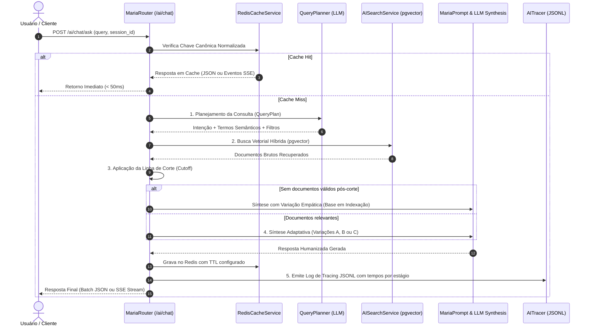

# Arquitetura e Pipeline da MarIA

A **MarIA** é a inteligência artificial conversacional do SIMCC, desenhada especificamente para conectar pesquisadores, gestores públicos e a sociedade ao conhecimento científico produzido no Estado da Bahia.

---

## 🎯 Filosofia de Design e Humanização

Historicamente, ferramentas de busca acadêmica oferecem respostas estritamente tabulares ou mecânicas. A MarIA foi concebida sob os seguintes princípios:

1. **Empatia e Acolhimento**: Comunicação clara, acessível, profissional e humanizada.
2. **Precisão Factual sem Alucinação**: Se os dados da base forem insuficientes ou não atenderem aos critérios de qualidade, o sistema informa isso com transparência em vez de inventar correlações.
3. **Adaptabilidade Contextual**: O tom e a densidade da resposta variam inteligentemente de acordo com a quantidade e a heterogeneidade das evidências científicas encontradas.

---

## 🔄 Fluxo Operacional da Pipeline de IA

A pipeline completa é orquestrada pelo [`MariaService`](file:///home/jaspion/Observatorio/Simcc/simcc-back/src/simcc/services/maria_service.py) e divide-se em 5 estágios bem delineados:

---

## 🧠 Estágios Detalhados

### 1. Planejador de Consultas (`QueryPlanner`)
O usuário expressa sua dúvida de forma livre em linguagem natural. O [`QueryPlanner`](file:///home/jaspion/Observatorio/Simcc/simcc-back/src/simcc/ai/query_planner.py) traduz essa intenção em uma estrutura semântica validada pelo Pydantic ([`QueryPlan`](file:///home/jaspion/Observatorio/Simcc/simcc-back/src/simcc/ai/query_planner.py#L32-L42)) utilizando saída estruturada (*Structured Outputs*) via LangChain e modelo `gpt-4o-mini` com temperatura zero.

A estrutura é composta por:
* **`intent`**: Classificação taxonômica da intenção do usuário;
* **`semantic_query`**: Termos conceituais higienizados para geração de embeddings (removendo saudações e siglas de instituições já filtradas);
* **`filters`**: Objeto [`SearchFilters`](file:///home/jaspion/Observatorio/Simcc/simcc-back/src/simcc/ai/query_planner.py#L8-L30) contendo restrições categóricas, institucionais, temporais e espaciais aplicadas no SQL relacional.

#### Classificação de Intenções (`intent`)

| Intenção (`intent`) | Descrição e Comportamento | Exemplo de Consulta |
|:---|:---|:---|
| `researcher_search` | Busca temático-institucional para localizar ou comparar pesquisadores por área, competência ou instituição. | *"Quais pesquisadores da UNEB trabalham com linguística?"* |
| `production_search` | Busca focada em produções científicas e tecnológicas (artigos, livros, patentes, softwares, relatórios). | *"Quais patentes e registros foram desenvolvidos na UFBA?"* |
| `researcher_profile` | Perfil acadêmico, biografia científica ou trajetória de um indivíduo específico. | *"Quem é Eduardo Manuel de Freitas Jorge e quais são suas áreas de atuação?"* |
| `aggregation` | Consultas analíticas, volumétricas e estatísticas sobre o ecossistema de dados. | *"Quantos artigos foram publicados na Bahia em 2023?"* |
| `general_question` | Saudações, apresentações institucionais ou dúvidas gerais sobre as funcionalidades do SIMCC. | *"Olá MarIA, como você pode me ajudar a explorar a ciência baiana?"* |

#### Filtros Estruturados (`SearchFilters`)

| Campo | Tipo | Descrição | Exemplos Aceitos |
|:---|:---|:---|:---|
| `institutions` | `List[str]` | Lista de siglas ou nomes de instituições mencionadas na consulta. | `["UFBA"]`, `["UNEB", "UEFS"]`, `["UFRB"]`, `["UESB"]` |
| `researcher_name` | `Optional[str]` | Nome específico do pesquisador quando a consulta é direcionada a um indivíduo. | `"Eduardo Manuel de Freitas Jorge"`, `"Adilson"` |
| `production_types` | `List[str]` | Lista de tipos específicos de produção catalogados (vazio busca em todas). | `["ARTICLE"]`, `["PATENT"]`, `["BOOK", "BOOK_CHAPTER"]` |
| `city` | `Optional[str]` | Polo municipal ou cidade do Estado da Bahia mencionada. | `"Salvador"`, `"Feira de Santana"`, `"Ilhéus"` |
| `identity_territory` | `Optional[str]` | Nome do Território de Identidade da Bahia (tabela relacional N:N `researcher_institution`). | `"Portal do Sertão"`, `"Chapada Diamantina"`, `"Litoral Sul"` |
| `qualis` | `List[str]` | Lista de estratos Qualis da CAPES para artigos de periódicos. Permite filtragem múltipla simultânea. | `["A1"]`, `["A1", "A2"]`, `["B1", "B2", "B3"]` |
| `year_from` | `Optional[int]` | Ano inicial para recorte temporal da busca. | `2019`, `2024` |
| `year_to` | `Optional[int]` | Ano final para recorte temporal da pesquisa. | `2023`, `2026` |

#### Tipos de Produção Suportados (`production_types`)

| Tipo (`production_type`) | Descrição | Termos Comuns Identificados |
|:---|:---|:---|
| `ARTICLE` | Artigos publicados em periódicos científicos | *"artigos", "papers", "publicações"* |
| `BOOK` | Livros completos publicados | *"livros", "obras completas"* |
| `BOOK_CHAPTER` | Capítulos de livros e coletâneas | *"capítulos de livros", "capítulos publicados"* |
| `PATENT` | Patentes e registros de propriedade intelectual | *"patentes", "invenções", "propriedade intelectual"* |
| `SOFTWARE` | Programas de computador e sistemas registrados | *"softwares", "programas", "sistemas"* |
| `REPORT` | Relatórios técnicos e de pesquisa | *"relatórios técnicos", "relatórios de projetos"* |

### 2. Busca Vetorial Híbrida (`AISearchService`)
Integrada ao PostgreSQL 17 utilizando a extensão **`pgvector`**:
* A consulta semântica é convertida em um vetor denso (1536 dimensões);
* É executada a busca por vizinhos mais próximos utilizando a métrica de **distância cosseno** (`<=>`);
* Os filtros relacionais (instituição, grandes áreas) são aplicados de forma combinada no SQL para máxima precisão e performance.

### 3. Linha de Corte de Relevância Semântica (`Cosine Distance Cutoff`)
Para eliminar correspondências forçadas e ruídos de baixa relevância:
* O sistema aplica a condição:
  $$\text{distância cosseno} \le \text{limiar}$$
* Por padrão, adota-se um limiar rigoroso (ex: `0.65`), configurável via `AI_SEARCH_SIMILARITY_THRESHOLD`.
* **Tratamento de Gaps de Qualidade**: Quando nenhum documento ultrapassa o corte de relevância, o sistema **não** envia dados irrelevantes ao modelo de síntese. Em vez disso, aciona a estratégia empática explicando que a base científica baiana está em contínuo processamento e indexação, orientando o usuário a refinar os termos.

### 4. Variações Comportamentais de Resposta (`maria_prompts.py`)
Conforme a natureza dos resultados aprovados na triagem, a MarIA adota uma das 5 variações dinâmicas de prompt:

| Variação | Gatilho de Contexto | Estilo Comportamental |
|:---|:---|:---|
| **Variação A (Grande Volume)** | Mais de 5 registros encontrados | Visão panorâmica executiva, destacando grandes tendências, instituições líderes e eixos principais sem listagens exaustivas e mecânicas. |
| **Variação B (Volume Reduzido)** | Entre 1 e 4 registros encontrados | Análise individual rica e detalhada, contextualizando a produção e a relevância de cada pesquisador ou trabalho catalogado. |
| **Variação C (Heterogênea)** | Múltiplas instituições ou tipos mistos | Estrutura comparativa e categorizada por eixos temáticos ou institucionais, facilitando a navegação multidimensional. |
| **Variação D (Vazia / Pós-Corte)** | Zero registros ou registros descartados | Resposta acolhedora e transparente informando o processamento progressivo da base de dados e sugerindo alternativas de busca. |
| **Variação E (Conversacional)** | Saudações ou perguntas institucionais | Recepção amigável, orientando sobre o papel do SIMCC e convidando o usuário a explorar a produção científica da Bahia. |

### 5. Resiliência e Fallback de Provedor
O sistema trata a ausência ou falha temporária da `OPENAI_API_KEY`:
* Caso a chave não esteja definida ou o provedor esteja indisponível, a API responde graciosamente com **HTTP 503** (ou evento SSE `error`), fornecendo mensagem clara e sem causar crashes na aplicação.

---

## 🔍 6. Clarificação Conversacional e Human-in-the-Loop

Consultas envolvendo nomes de pesquisadores frequentemente contêm ambiguidades, erros de digitação ou omissões de sobrenomes intermediários. O ecossistema MarIA conta com um subsistema inteligente de desambiguação composto por:

* **`ResearcherMatcher`**: Realiza normalização avançada (remoção de acentuação, stop-words de patronímicos e pontuações) e busca fuzzy com pontuação de similaridade trigram (`pg_trgm`) e tolerância a sobrenomes intermediários ausentes (ex: *"Eduardo Jorge"* $\rightarrow$ *"Eduardo Manuel de Freitas Jorge"*).
* **`ClarificationManager`**:
  * **Auto-resolução com Alta Confiança**: Quando um candidato único atinge pontuação elevada ($\ge 0.85$), o sistema resolve imediatamente sem interromper a fluidez do usuário.
  * **Interrupção Human-in-the-Loop**: Quando múltiplos candidatos plausíveis são identificados, emite um `ClarificationPayload` com opções estruturadas para escolha do usuário via modal interativo no frontend.
  * **Persistência de Estado**: Salva o contexto pendente no Redis com TTL para reidratação instantânea quando o usuário seleciona a opção desejada.

---

## 💬 7. Memória Conversacional e Continuidade com LangChain

Para garantir que a MarIA se comporte como uma verdadeira assistente dialógica (e não como um mecanismo stateless), o sistema integra o histórico de diálogo através das abstrações oficiais do **LangChain Core**:

* **`SIMCCChatMessageHistory`**: Implementação especializada que herda de `BaseChatMessageHistory`, armazenando mensagens com janela deslizante configurável (`max_messages`) e sincronização assíncrona com o Redis sob a chave `simcc:ai:chat_history:{session_id}`.
* **`MessagesPlaceholder` no `QueryPlanner`**: O pipeline LCEL injeta o histórico conversacional recente, permitindo resolução anafórica (ex: ao perguntar *"E quais são os artigos dele?"*, o planejador identifica o pesquisador tratado no turno anterior e completa os filtros com o nome canônico).
* **Herança Contextual de Entidades**: Ao confirmar um pesquisador (seja por seleção ou auto-resolução), a entidade ativa da sessão é armazenada em cache. Consultas subsequentes com menção parcial ao nome herdam automaticamente a identidade estabelecida sem abrir clarificações redundantes.
* **Diretriz de Continuidade Conversacional**:
  Quando há diálogo em andamento na sessão, o prompt de síntese injeta a diretriz:
  > **[!DIRETRIZ DE CONTINUIDADE CONVERSACIONAL]**
  > Esta mensagem é uma CONTINUAÇÃO de diálogo já em andamento.
  > NUNCA cumprimente o usuário ("Olá", "Tudo bem?", "Como assistente do SIMCC...").
  > Vá DIRETO ao ponto respondendo à solicitação com fluidez natural.

---

## ⏳ 8. Filtros Temporais e Recuperação Híbrida de Produções (Issue #16)

A busca por produções científicas e tecnológicas (`AISearchService.search_productions_hybrid`) aplica recortes temporais (`year_from` e `year_to`) diretamente na camada relacional SQL antes do ranking semântico:

* **Subqueries SQL Unificadas**: Executa subqueries via `UNION` nas tabelas de base (`bibliographic_production`, `patent`, `software`, `research_report`), extraindo os identificadores válidos dentro da janela de anos.
* **Cláusula `IN` no Índice Vetorial**: Restringe a busca em `search_document_production` exclusivamente às produções temporariamente válidas (`production_id.in_(valid_ids)`).
* **Verificação Defensiva**: Validação auxiliar em memória no `MariaService` garante conformidade estrita contra desvios de metadados antes do envio ao modelo de síntese.

---

## 📊 9. Contextualização Quantitativa Global e Métricas de Carreira (`AIMetricsService`)

A amostragem de 10 produções ou pesquisadores para o prompt da LLM causava uma percepção incorreta de escassez da produção científica (em especial na **UFBA**). Para resolver isso:

* **Amostra vs. Totalidade**: O serviço calcula o total exato de itens correspondentes na base e insere no prompt o bloco `### Contexto Quantitativo Global no SIMCC`, alertando a IA para contextualizar a real magnitude do tema no Estado da Bahia antes de citar os exemplos da amostra.
* **Distribuição Institucional (*Market Share*)**: O serviço calcula a participação percentual histórica de cada instituição na base estadual (ex: liderança histórica da UFBA com ~68% dos registros), mantendo cache otimizado no Redis.
* **Métricas de Carreira**: Cada autor/pesquisador recuperado é enriquecido com totais agregados das tabelas `researcher_production` (artigos, livros, capítulos, patentes, softwares) e `openalex_researcher` (índice H e citações), proporcionando visibilidade integral sobre o histórico acadêmico do pesquisador.
