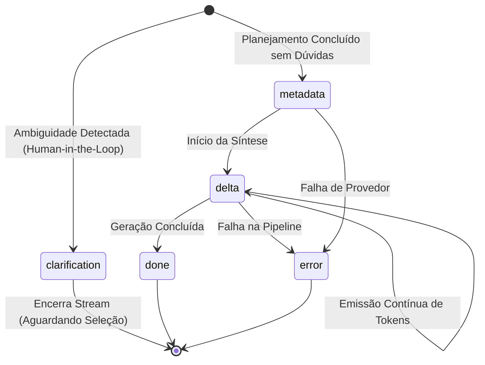

# Contratos de API e Streaming

Esta seção documenta a especificação técnica formal dos endpoints conversacionais da **MarIA** no SIMCC Backend. A preservação destes contratos é mandatória (conforme o **Princípio I** da Constituição do SIMCC e a história **US5** da especificação), garantindo compatibilidade total com o frontend em produção.

---

## 1. POST `/ai/chat/ask` (Modo Lote / Batch JSON)

Executa a pipeline completa e retorna a resposta final consolidada em um único payload JSON.

### Requisição
* **URL**: `/ai/chat/ask`
* **Método**: `POST`
* **Headers**: `Content-Type: application/json`

```json
{
  "query": "Quais artigos sobre IA foram publicados por Eduardo Jorge?",
  "session_id": "sess_a81f4c2e-9821",
  "clarification_response": {
    "field": "researcher_id",
    "value": "c71a39f0-2f64-4e20-951b-1d7b32408ec2"
  }
}
```

| Campo | Tipo | Obrigatório | Descrição |
|:---|:---|:---|:---|
| `query` | `string` | Sim | Texto livre com a pergunta ou termo de busca do usuário. |
| `session_id` | `string` | Não | Identificador de sessão para correlação de contexto, memória e telemetria. |
| `clarification_response` | `Optional[ClarificationResponse]` | Não | Resposta do usuário contendo `{ "field": "researcher_id", "value": "<UUID>" }` para desambiguação prévia. |

---

### Respostas

#### 🟢 200 OK (Sucesso Consolidado com Métricas Globais)
Retorna a resposta elaborada pela MarIA, entidades catalogadas, indicadores de carreira e o contexto institucional estadual:

```json
{
  "answer": "Identificamos produções relevantes do pesquisador **Eduardo Manuel de Freitas Jorge** (UNEB)...",
  "intent": "production_search",
  "filters_extracted": {
    "institutions": [],
    "production_types": ["ARTICLE"],
    "researcher_name": "Eduardo Manuel de Freitas Jorge",
    "researcher_ids": ["c71a39f0-2f64-4e20-951b-1d7b32408ec2"]
  },
  "researchers": [
    {
      "id": "c71a39f0-2f64-4e20-951b-1d7b32408ec2",
      "name": "Eduardo Manuel de Freitas Jorge",
      "institution": "Universidade do Estado da Bahia",
      "institution_acronym": "UNEB",
      "lattes_id": "1234567890123456",
      "metrics": {
        "articles": 42,
        "books": 3,
        "book_chapters": 15,
        "patents": 2,
        "software": 5,
        "h_index": 12,
        "citations": 680
      }
    }
  ],
  "productions": [
    {
      "id": "prod-1",
      "title": "Aplicações de Redes Neurais em Saúde Pública",
      "type": "ARTICLE",
      "year": 2023,
      "researcher": {
        "id": "c71a39f0-2f64-4e20-951b-1d7b32408ec2",
        "name": "Eduardo Manuel de Freitas Jorge",
        "institution": "UNEB",
        "metrics": {
          "articles": 42,
          "h_index": 12
        }
      }
    }
  ],
  "sources": [
    "Eduardo Manuel de Freitas Jorge (UNEB)"
  ],
  "global_metrics": {
    "total_matched": 42,
    "sample_count": 1,
    "institution_shares": {
      "UFBA": { "total_productions": 15200, "share": "68.4%" },
      "UNEB": { "total_productions": 3120, "share": "14.1%" },
      "UEFS": { "total_productions": 1890, "share": "8.5%" }
    },
    "warning": "Amostra restrita aos itens mais semanticamente relevantes."
  },
  "clarification": null
}
```

#### 🟡 200 OK (Solicitação de Clarificação / Desambiguação de Pesquisador)
Quando o sistema encontra ambiguidade em nomes de pesquisadores, o modelo pausa a síntese e solicita a escolha do usuário:

```json
{
  "answer": "Identifiquei mais de um pesquisador com esse nome. Por favor, selecione qual deles você deseja consultar:",
  "intent": "production_search",
  "filters_extracted": {
    "researcher_name": "Eduardo Jorge"
  },
  "researchers": [],
  "productions": [],
  "sources": [],
  "clarification": {
    "type": "researcher_disambiguation",
    "question": "Identifiquei mais de um pesquisador com esse nome. Por favor, selecione qual deles você deseja consultar:",
    "field_to_bind": "researcher_id",
    "options": [
      {
        "id": "c71a39f0-2f64-4e20-951b-1d7b32408ec2",
        "label": "Eduardo Manuel de Freitas Jorge",
        "description": "Universidade do Estado da Bahia (UNEB)"
      },
      {
        "id": "9b12a344-3d12-4c55-88aa-21d7b32408ec1",
        "label": "Eduardo Jorge Valadares",
        "description": "Universidade Federal da Bahia (UFBA)"
      }
    ],
    "original_query": "artigos de Eduardo Jorge"
  }
}
```

#### 🟡 503 Service Unavailable (Sem API Key ou Provedor Indisponível)
Quando a variável de ambiente `OPENAI_API_KEY` não estiver definida ou o provedor externo de IA estiver indisponível:

```json
{
  "detail": "O serviço de inteligência artificial está temporariamente indisponível ou não configurado."
}
```

---

## 2. POST `/ai/chat/ask/stream` (Streaming via Server-Sent Events)

Permite transmissão em tempo real das palavras e parágrafos gerados pela MarIA, garantindo fluidez e reduzindo o tempo percebido de espera.

### Requisição
* **URL**: `/ai/chat/ask/stream`
* **Método**: `POST`
* **Headers**:
  * `Content-Type: application/json`
  * `Accept: text/event-stream`

```json
{
  "query": "Patentes registradas na área de biotecnologia na Bahia",
  "session_id": "sess_39b2e71c-4389",
  "clarification_response": null
}
```

---

### Protocolo de Eventos SSE (`text/event-stream`)

O stream emite eventos no formato padrão `data: <JSON>\n\n`, obedecendo rigorosamente à seguinte máquina de estados:



#### Evento Especial: `clarification`
Emitido quando a consulta apresenta ambiguidade de pesquisador. O backend envia o payload de opções e encerra a conexão para aguardar a escolha do usuário:

```text
data: {"type": "clarification", "message_id": "sess_39b2e71c-4389", "data": {"type": "researcher_disambiguation", "question": "Identifiquei mais de um pesquisador. Por favor, selecione:", "field_to_bind": "researcher_id", "options": [{"id": "c71a39f0-2f64-4e20-951b-1d7b32408ec2", "label": "Eduardo Manuel de Freitas Jorge", "description": "UNEB"}]}}

```

#### Evento 1: `metadata`
Emitido imediatamente após a busca vetorial e antes da geração do texto. Contém a intenção extraída, filtros, entidades encontradas e o contexto estatístico global:

```text
data: {"type": "metadata", "message_id": "sess_39b2e71c-4389", "data": {"intent": "production_search", "filters": {"production_types": ["PATENT"]}, "researchers": [], "productions": [{"id": "pat-01", "title": "Processo de Extração de Biopolímeros a partir de Resíduos de Cacau", "type": "PATENT", "year": 2023}], "sources": ["Processo de Extração de Biopolímeros... [PATENT] (2023)"], "global_metrics": {"total_matched": 87, "sample_count": 1, "institution_shares": {"UFBA": {"total_productions": 62, "share": "71.2%"}, "UESC": {"total_productions": 15, "share": "17.2%"}}}}}

```

#### Eventos 2 a N: `delta`
Fragmentos de texto enviados incrementalmente à medida que o modelo sintetiza a resposta:

```text
data: {"type": "delta", "message_id": "sess_39b2e71c-4389", "content": "No ecossistema de inovação da **Bahia**, "}

data: {"type": "delta", "message_id": "sess_39b2e71c-4389", "content": "foram catalogadas patentes relevantes no segmento de biotecnologia..."}

```

#### Evento Final de Sucesso: `done`
Sinaliza ao frontend o encerramento da transmissão:

```text
data: {"type": "done", "message_id": "sess_39b2e71c-4389"}

```

#### Evento em Caso de Falha: `error`
Emitido caso ocorra timeout, interrupção ou ausência de credenciais durante a pipeline:

```text
data: {"type": "error", "message_id": "sess_39b2e71c-4389", "code": "ai_unavailable", "message": "O serviço de inteligência artificial está temporariamente indisponível."}

```

