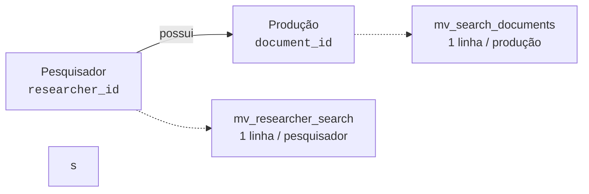

# Arquitetura e Visões Materializadas

Para que o SIMCC responda buscas de forma instantânea sobre centenas de milhares de produções acadêmicas, a versão 2 (V2) adota uma arquitetura baseada em **Visões Materializadas (Materialized Views)**.

---

## Por que Visões Materializadas?

Em sistemas tradicionais, uma busca textual com múltiplos filtros costuma juntar muitas tabelas (`JOIN` de pesquisadores, artigos, livros, instituições e programas) e aplicar buscas por texto parcial (`ILIKE '%termo%'`). 

Conforme o volume de dados cresce, essa abordagem causa:

* Consultas lentas (travando o banco de dados).
* Alto consumo de CPU e memória.
* Dificuldade de ranquear resultados por relevância.

Com **Visões Materializadas**, o banco de dados pré-processa e consolida as informações em segundo plano. Quando o usuário faz uma busca, ele consulta estruturas já prontas e otimizadas com índices textuais (GIN).

---

## As Duas Camadas de Dados

A arquitetura da V2 divide os dados de busca em duas camadas com papéis complementares:

### Camada 1: Documentos (`mv_search_documents`)
* **Papel:** Responder *"Em quais produções o termo pesquisado aparece?"*.
* **Granularidade:** Cada linha representa uma produção individual (um artigo, um livro, uma patente, etc.).
* **Otimização:** Possui índice invertido (GIN) sobre o texto tratado sem acentuação (`pt_unaccent`), permitindo localizar termos instantaneamente.

### Camada 2: Perfil do Pesquisador (`mv_researcher_search`)
* **Papel:** Responder *"Quais pesquisadores atendem aos filtros estruturais?"*.
* **Granularidade:** Exatamente uma linha por pesquisador cadastrado.
* **Otimização:** Guarda vetores do perfil (nome e resumo) e arrays compactos com as instituições, programas de pós-graduação e anos de produção.

### Resumo Comparativo

| Característica | Camada 1: Documentos | Camada 2: Pesquisador |
|---|---|---|
| **Nome da MV** | `mv_search_documents` | `mv_researcher_search` |
| **Linhas** | Uma por produção acadêmica | Uma por pesquisador |
| **Busca Textual** | Títulos e metadados das obras | Nome e resumo do currículo |
| **Filtros Estruturais** | Ano da obra e tipo de fonte | Vínculos, programas e anos ativos |
| **Uso Principal** | Identificar obras e extrair evidências | Paginação principal e contagem de autores |

---

## Atualização dos Dados (Refresh)

Como as visões materializadas guardam uma "fotografia" dos dados, elas precisam ser atualizadas periodicamente conforme novos currículos Lattes são importados.

* **Atualização em Lote (`CONCURRENTLY`):** O processo de atualização atualiza os dados em segundo plano sem travar as leituras dos usuários.
* **Ordem de Dependência:** As visões de produção individuais são atualizadas primeiro, seguidas pela Camada 1 e, por fim, a Camada 2.
* **Data da Fotografia (`data_as_of`):** A API mantém em memória a data do último refresh. Assim, o frontend e os usuários sabem exatamente o quão recentes são as informações pesquisadas, sem gastar nenhuma consulta ao banco de dados para checar esse timestamp.
