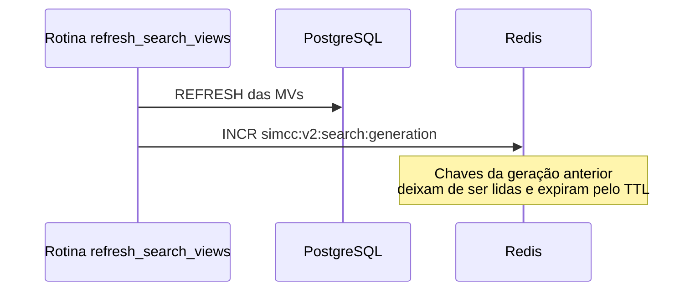

# Cache de Buscas

`GET /v2/researcher` guarda a resposta completa (pesquisadores, paginação, facets e evidências) no Redis. Uma busca repetida é servida **sem nenhuma consulta ao banco**.

---

## Como saber se veio do cache

O campo `meta` sempre é calculado na hora:

```json
"meta": { "took_ms": 1, "cached": true, "timestamp": "...", "data_as_of": null }
```

`filters_applied` também reflete a requisição atual, mesmo em um acerto.

---

## Quando o cache é invalidado

Os dados da busca só mudam quando as visões materializadas são atualizadas. Por isso o cache é invalidado **pela rotina de refresh**, e não por tempo:



A chave de cada busca é `simcc:v2:researcher_search:<geração>:<hash dos parâmetros>`. Ao incrementar a geração, todas as buscas seguintes caem em chaves novas. Não há varredura nem remoção de chaves.

!!! note "Parâmetros equivalentes compartilham o cache"
    A ordem dos valores em listas não importa: `institution_id=A&institution_id=B` e `institution_id=B&institution_id=A` usam a mesma entrada. Validações (HTTP 422) sempre rodam antes do cache.

---

## Se o Redis cair

O cache é um acelerador, nunca uma dependência:

* Qualquer falha de leitura ou escrita faz a busca seguir direto para o banco.
* Na primeira falha, o cache fica desligado por **30 segundos** naquele processo, para que as requisições não paguem o timeout de conexão.
* Se a rotina de refresh não conseguir incrementar a geração, ela registra um aviso e termina normalmente. O cache antigo segue válido até expirar pelo TTL.

---

## Configuração

| Variável | Padrão | Descrição |
|---|---|---|
| `REDIS_URL` | `redis://localhost:6379/0` | Conexão com o Redis (no `compose.yaml`: `redis://redis:6379/0`). |
| `REDIS_ENABLED` | `true` | Desliga todo o cache da aplicação quando `false`. |
| `V2_SEARCH_CACHE_TTL` | `21600` (6h) | Tempo de vida de cada entrada. Só limita o uso de memória: a invalidação real acontece no refresh. |

!!! warning "Respostas incluem dados lidos na hora"
    Os vínculos institucionais (`affiliations`) vêm das tabelas base, mas fazem parte da resposta guardada. Uma alteração em `researcher_institution` só aparece na busca após o próximo refresh, junto com o restante dos dados.

Os testes rodam sempre com o cache ligado, num Redis descartável. Veja [Criação de Testes](../guia-contribuicao/testes.md#infraestrutura-containers-fixtures-e-client).
