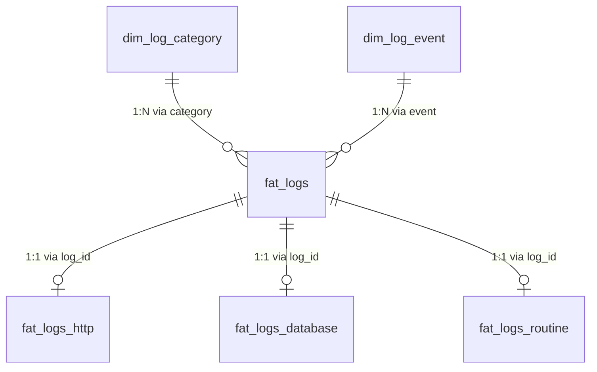

# Logs Estruturados e Observabilidade

O SIMCC adota um modelo de **logs estruturados em JSONL** baseado em **modelagem dimensional (*Star Schema*)**. Essa abordagem permite monitorar requisições web, comandos de banco e rotinas em lote, servindo tanto para análise de falhas operacionais quanto para exportação analítica direta no Power BI.

---

## Filosofia do Design

Cada evento registrado no sistema combina um **envelope raiz padronizado** com um **nó de detalhes polimórfico** (`data`).

```json
{
  "timestamp": "2026-09-30T22:30:00.123456Z",
  "level": "info",
  "application": "simcc",
  "environment": "development",
  "hostname": "server-01",
  "category": "http",
  "event": "request.finished",
  "message": "Request finished: GET /v2/researcher [200]",
  "request_id": "c9a4df58-1a2b-...",
  "duration": 42.5,
  "data": {
    "route": "/v2/researcher",
    "method": "GET",
    "status_code": 200,
    "user_id": null,
    "error_message": null
  }
}
```

### 1. Envelope Comum Universal

Campos presentes em **todas** as entradas de log, independentemente da categoria:

| Campo | Tipo | Descrição |
|---|---|---|
| `timestamp` | `string` | Data e hora UTC no formato ISO 8601 com sufixo `Z`. |
| `level` | `string` | Nível de severidade (`debug`, `info`, `warning`, `error`, `critical`). |
| `application` | `string` | Identificador do serviço (padrão: `simcc`). |
| `environment` | `string` | Ambiente de execução (`development`, `production`, `test`). |
| `hostname` | `string` | Nome da máquina ou contêiner que originou o evento. |
| `category` | `string` | Categoria de alto nível (`http`, `database`, `routine`, `script`, `system`). |
| `event` | `string` | Ação pontual executada (`request.finished`, `query.slow`, etc.). |
| `request_id` | `string` | UUID de correlação assíncrona gerado ou repassado via header `x-request-id`. |
| `duration` | `float` | Tempo de execução decorrido em milissegundos. |
| `message` | `string` | Descrição resumida legível para humanos. |

### 2. O Campo `data` (Expansão Contextual)

Em vez de poluir a raiz do log com dezenas de colunas esparsas e nulas, os dados específicos de cada contexto ficam restritos ao objeto **`data`**:

* **Categoria `http`:**
  Possui `{ route, method, status_code, user_id, error_message }`. Respostas HTTP 4xx são automaticamente classificadas como `warning`, 5xx como `error`, e requisições normais como `info`.
* **Categoria `database`:**
  Possui `{ database_name, operation_name, duration, error_message, sql }`.
* **Categoria `routine` e `script`:**
  Possui `{ routine_name, items_found, items_succeeded, items_failed, error_message }`.

---

## Modelo Dimensional para o Power BI

Os endpoints analíticos em `/v1/fat_logs*.csv` usam o motor colunar **Polars** para transformar os arquivos `.jsonl` em tabelas estreitas relacionadas por uma chave primária sintética (`log_id`):



### Por que esse formato é vantajoso no BI?

1. **Evita tabelas largas cheias de `NULL`:** No modelo plano tradicional, colunas como `sql` ou `items_succeeded` seriam nulas em 80% dos registros. O desdobramento em tabelas fato especializadas gera arquivos compactos e perfeitamente tipados (`Int64`, `Float64`, `Utf8`).
2. **Filtragem Cruzada Direta:** Clicar em um erro no painel geral de `fat_logs` filtra instantaneamente os detalhes da query em `fat_logs_database` ou da rota em `fat_logs_http`.
3. **Compressão Colunar:** Tabelas estreitas e homogêneas comprimem significativamente melhor na memória da ferramenta de BI.

---

## Armazenamento e Política de Retenção

Os logs são gravados no disco local no formato **JSON Lines** (uma linha por evento):

* **Localização dos arquivos:** Diretório configurado por `LOG_DIR` (padrão: `logs/`).
* **Nomenclatura diária:** `logs/YYYY-MM-DD.jsonl` (ex.: `logs/2026-09-30.jsonl`).
* **Política de expurgo automático:** Arquivos mais antigos que `LOG_RETENTION_DAYS` (padrão: **7 dias**) são excluídos automaticamente em dois momentos:
  1. Durante a inicialização do backend (`lifespan` do FastAPI).
  2. A cada virada de dia durante a gravação contínua.

---

## Detecção de Slow Queries (Consultas Lentas)

Para não onerar o I/O do sistema, o listener do SQLAlchemy **não grava** consultas rápidas rotineiras. O sistema monitora apenas exceções e atrasos anormais:

* **Limiar de alerta:** `SLOW_QUERY_THRESHOLD_MS = 1000.0` (1 segundo).
* **Comportamento:** Consultas que excedem 1000ms geram um log com nível `warning` e evento `query.slow`.
* **Proteção de segurança de dados:** O texto SQL da consulta só é inserido no log se o `LOG_LEVEL` estiver configurado explicitamente como `DEBUG`.

---

## Streaming em Tempo Real (WebSocket)

Para depuração ao vivo e monitoramento direto por ferramentas internas, a API disponibiliza um canal WebSocket:

* **Endpoint:** `WS /v1/logs/stream?token=<LOG_STREAM_TOKEN>`
* **Segurança:** Requer autenticação via token (`LOG_STREAM_TOKEN` em `Settings`). Se não configurado, gera um token volátil aleatório no startup.
* **Proteção contra DoS:** Limite de 5 conexões simultâneas (retornando código `4008` caso excedido).

---

## Configuração

| Variável | Padrão | Descrição |
|---|---|---|
| `LOG_DIR` | `logs` | Diretório onde os arquivos `.jsonl` são armazenados. |
| `LOG_LEVEL` | `INFO` | Nível mínimo para registro (`DEBUG`, `INFO`, `WARNING`, `ERROR`). |
| `LOG_RETENTION_DAYS` | `7` | Dias de retenção antes do expurgo automático dos arquivos. |
| `LOG_STREAM_TOKEN` | `null` | Token estático para autenticar a conexão WebSocket em `/logs/stream`. |
