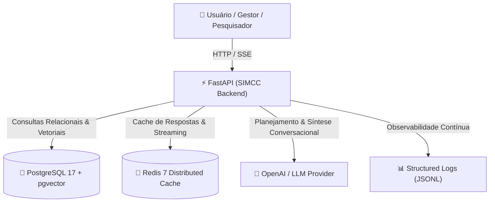

# SIMCC Backend & MarIA

Bem-vindo à documentação técnica e arquitetural do **SIMCC Backend** (*Sistema de Informação para a Gestão da Pesquisa e Inovação*).

O SIMCC é a plataforma que mapeia, conecta e dá visibilidade à produção acadêmica, tecnológica e científica de instituições de ensino superior e institutos de pesquisa no Estado da Bahia.

---

## 🌟 Visão Geral da Plataforma

O backend do SIMCC foi concebido para atender tanto a consultas analíticas estruturadas de gestores e pesquisadores quanto a interações conversacionais inteligentes. Por meio da assistente científica **MarIA**, usuários podem realizar perguntas em linguagem natural e obter sínteses ricas, contextualizadas e semanticamente aderentes aos pesquisadores e produções científicas cadastradas.



---

## 🧭 Pilares Arquiteturais

A evolução recente do sistema consolidou pilares fundamentais de engenharia:

### 1. Inteligência Artificial Humanizada e Responsável (MarIA)
A MarIA transcende a simples listagem mecânica de itens de banco de dados. Ela sintetiza achados, identifica líderes de pesquisa, agrupa produções multidisciplinares e respeita uma linha de corte semântico para jamais alucinar ou forçar correspondências espúrias.

### 2. Desempenho e Escalabilidade com Cache Distribuído
Em ambientes de produção com múltiplos workers assíncronos (Uvicorn), o **Redis** opera como camada de aceleração compartilhada. Consultas frequentes — tanto em requisições REST tradicionais quanto em transmissões de streaming Server-Sent Events (SSE) — são respondidas em frações de milissegundos, poupando tokens e processamento vetorial.

### 3. Confiabilidade e Governança
Todas as decisões arquiteturais seguem a **Constituição do SIMCC**, assegurando:
- Preservação estrita dos contratos consumidos pelo frontend;
- Observabilidade estruturada em formato JSONL para cada etapa da pipeline;
- Arquitetura de testes em camadas (unitários, integração com `testcontainers` e isolamento por savepoints);
- Código limpo, tipado e validado continuamente pelo Ruff.

---

## 📚 Mapa da Documentação

Navegue pelas seções para aprofundar-se nas especificações e guias práticos:

* [**Arquitetura e Pipeline da MarIA**](ai_architecture.md): Descubra o ciclo completo da pipeline de IA — desde o *Query Planner*, busca vetorial no `pgvector`, limiar de corte cosseno, até a geração de variações empáticas de resposta.
* [**Cache Distribuído e Telemetria**](cache_and_telemetry.md): Entenda como o Redis gerencia namespaces, serialização segura, replay de streams e como a telemetria em JSONL quantifica custos e latências por estágio.
* [**Contratos de API e Streaming**](api_contracts.md): Especificação detalhada dos payloads JSON para `/ai/chat/ask` e da sequência padronizada de eventos SSE para `/ai/chat/ask/stream`.
* [**Metodologia de Testes e Golden Dataset**](ai_testing_and_dataset.md): Guia prático da elaboração da base assinada (SHA-256), extração estratificada, reidratação (seeding), execução de testes em camadas e métricas de avaliação de recuperação (Precision@k, Recall@k, MRR).

---

## 🚀 Como Executar Localmente

### Pré-requisitos
* Python 3.13+ com Poetry
* Docker e Docker Compose (para PostgreSQL com pgvector e Redis)

### Comandos Rápidos

```bash
# 1. Subir a infraestrutura de banco e cache
docker compose up -d postgres redis

# 2. Instalar as dependências do projeto
poetry install

# 3. Executar as migrações do banco
poetry run alembic upgrade head

# 4. Iniciar a API em modo desenvolvimento
poetry run task run

# 5. Executar a documentação localmente
poetry run mkdocs serve
```
