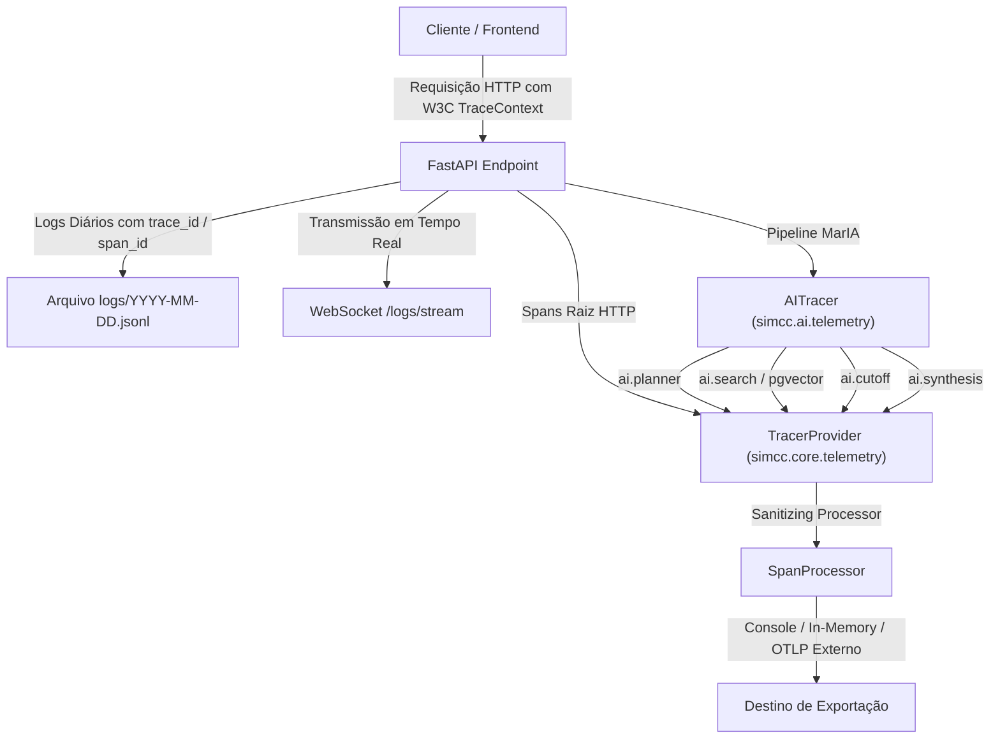

# Arquitetura de Observabilidade e Telemetria

O SIMCC Backend adota uma estratégia moderna, vendor-neutral e orientada a padrões abertos para observabilidade, integrando **OpenTelemetry (OTel)** e **Logs Estruturados JSONL**.



---

## 1. Pilares de Observabilidade

O ecossistema do SIMCC é monitorado através de três camadas integradas:

1. **Rastreamento Distribuído (OpenTelemetry Traces)**: Mapeamento de spans da requisição HTTP e dos estágios internos da MarIA (`planner`, `search`, `synthesis`), registrando latências granulares e metadados de execução.
2. **Logs Estruturados JSONL**: Registro padronizado de eventos em disco (`logs/YYYY-MM-DD.jsonl`) com injeção automática de `trace_id` e `span_id`.
3. **Métricas de Domínio**: Contadores e histogramas em memória para quantificação de requisições de IA, acertos de cache e taxas de erro.

---

## 2. Coexistência entre Traces e Logs Estruturados

Toda linha de log gerada pelo `structlog` recebe automaticamente a correlação contextual com a requisição e com o span ativo do OpenTelemetry:

```json
{
  "timestamp": "2026-09-07T14:15:20.124Z",
  "level": "info",
  "application": "simcc",
  "environment": "development",
  "hostname": "SERVER-01",
  "category": "ai",
  "event": "ai.pipeline.completed",
  "message": "Pipeline de IA concluída em 1418.5ms (cache_hit=False)",
  "request_id": "9b1deb4d-3b7d-4bad-9bdd-2b0d7b3dcb6d",
  "duration": 1418.5,
  "data": {
    "route": "/ai/chat/ask",
    "method": "POST",
    "status": "success",
    "total_duration_ms": 1418.5,
    "stages": {
      "planner": 84.2,
      "search": 310.1,
      "synthesis": 980.5
    },
    "metadata": {
      "cache_hit": false,
      "intent": "researcher_search",
      "retrieved_count": 10,
      "cutoff_dropped_count": 5,
      "final_count": 5,
      "model": "gpt-4o-mini"
    },
    "trace_id": "4bf92f3577b34da6a3ce929d0e0e4736",
    "span_id": "00f067aa0ba902b7"
  }
}
```

---

## 3. Streaming e Monitoramento de Logs em Tempo Real

O SIMCC disponibiliza visualização em tempo real dos logs gerados:

* **Endpoint WebSocket**: [`/logs/stream`](file:///home/jaspion/Observatorio/Simcc/simcc-back/src/simcc/routers/logs.py) transmite novos eventos em formato JSON para clientes conectados.
* **Console Web Interno**: Acessível via navegador através dos arquivos estáticos montados em `/static/logs/index.html`.

---

## 4. Configurações de Telemetria e Exportadores

A telemetria do SIMCC é vendor-neutral, permitindo direcionar traces e métricas para qualquer coletor padrão da indústria ou mantê-los no console durante o desenvolvimento local.

### Tabela de Configurações de Ambiente

| Variável | Valor Padrão | Descrição |
|:---|:---|:---|
| `OTEL_ENABLED` | `true` | Habilita ou desabilita toda a instrumentação de telemetria |
| `OTEL_EXPORTER_TYPE` | `none` | Destino dos **traces** (`none`, `console`, `otlp`, `in_memory`) |
| `OTEL_METRICS_EXPORTER_TYPE` | `none` | Destino das **métricas** (`none`, `console`, `otlp`, `in_memory`) |
| `OTEL_EXPORTER_OTLP_ENDPOINT` | `http://localhost:4317` | Endereço gRPC de um OpenTelemetry Collector externo (caso use `otlp`) |
| `OTEL_EXPORTER_OTLP_INSECURE` | `true` | Conexão gRPC sem TLS para rede interna ou desenvolvimento |
| `OTEL_SAMPLING_RATIO` | `1.0` | Taxa de amostragem de spans (de `0.0` a `1.0`) |

### Modos de Execução

1. **Padrão Silencioso (`OTEL_EXPORTER_TYPE=none`)**:
   Contexto de traces (`trace_id`, `span_id`) é mantido e correlacionado aos logs JSONL, mas nenhum span cru/verboso é impresso no terminal/stdout.

2. **Desenvolvimento Local Verboso (`OTEL_EXPORTER_TYPE=console`)**:
   Spans são exibidos no console/stdout com formatação legível, sem depender de coletores ou serviços adicionais.

3. **Integração com Coletor Externo (`OTEL_EXPORTER_TYPE=otlp`)**:
   Caso deseje enviar spans para um OpenTelemetry Collector corporativo, Grafana Tempo, SigNoz ou Datadog, basta configurar o endpoint no `.env`:
   ```bash
   OTEL_EXPORTER_TYPE=otlp
   OTEL_EXPORTER_OTLP_ENDPOINT=http://seu-otel-collector:4317
   ```
