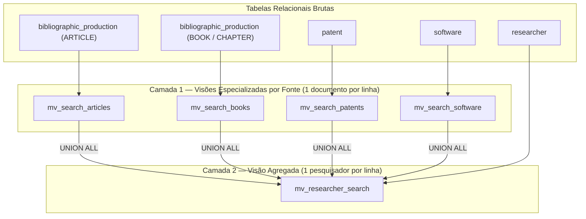

# Arquitetura de Busca Textual com Visões Materializadas

Esta seção descreve a estratégia arquitetural adotada para o motor de busca textual do SIMCC, fundamentada na criação de **visões materializadas em duas camadas**.

---

## 1. Contexto e Motivação

O SIMCC reúne um volume substancial de dados acadêmicos e tecnológicos: perfis de pesquisadores, produções bibliográficas (artigos, livros, capítulos), patentes e softwares.

Em uma abordagem relacional tradicional, consultas que combinam busca por termos textuais, filtros institucionais, programas de pós-graduação e janelas temporais enfrentam os seguintes desafios:

- **Custo de Junções (JOINs)**: Cruzar dinamicamente tabelas volumosas de produções para cada consulta do usuário consome recursos excessivos de I/O e CPU.
- **Cálculo de Vetores em Tempo de Execução**: Converter textos brutos em `tsvector` sob demanda penaliza o tempo de resposta e limita a escalabilidade da API.
- **Dificuldade de Extensão**: Adicionar novas modalidades de produção (como projetos de pesquisa ou orientações) tende a complicar ainda mais consultas SQL já sobrecarregadas.

Para superar essas barreiras, o sistema adota **visões materializadas desacopladas**, pré-computando vetores textuais ponderados e mantendo índices invertidos (GIN) prontos para consultas instantâneas.

---

## 2. Arquitetura em Duas Camadas

A separação do domínio de busca em duas camadas garante isolamento de responsabilidades, facilidade de manutenção e desempenho escalável.

### Camada 1 — Visões por Fonte (Granularidade: Documento)

Cada tipo de produção acadêmica e tecnológica possui uma visão materializada dedicada:

- **Artigos (`mv_search_articles`)**: Combina títulos, resumos e palavras-chave de produções bibliográficas e bases enriquecidas (OpenAlex).
- **Livros e Capítulos (`mv_search_books`)**: Foca nos títulos e metadados de livros e capítulos publicados.
- **Patentes (`mv_search_patents`)**: Indexa títulos e inventos tecnológicos registrados.
- **Softwares (`mv_search_software`)**: Indexa programas computacionais desenvolvidos.

**Padrão Contratual Uniforme**: Todas as visões da Camada 1 compartilham rigorosamente o mesmo conjunto de colunas conceituais:
1. `researcher_id`: Vínculo direto ao autor/pesquisador.
2. `source_id`: Identificador único do registro na tabela de origem.
3. `source_type`: Rótulo do tipo da fonte (`ARTICLE`, `BOOK`, `PATENT`, etc.).
4. `title`: Título da produção.
5. `year_`: Ano da produção.
6. `abstract`: Resumo textual (quando aplicável).
7. `search_vector`: Vetor textual pré-processado e ponderado.

> **Extensibilidade Futura**: Adicionar uma nova fonte de competência (como orientações concluídas ou projetos de pesquisa) requer apenas a criação de uma nova visão nesse mesmo molde, sem qualquer alteração nas visões já existentes.

### Camada 2 — Visão Consolidada (`mv_researcher_search`)

A Camada 2 consolida o perfil completo do pesquisador, agregando as produções da Camada 1 via `UNION ALL`:

- **Granularidade**: Exatamente **uma linha por pesquisador**.
- **Dados Institucionais**: Associação com a instituição de vínculo (nome, sigla e identificador).
- **Programas de Pós-Graduação**: Conjunto pré-agregado de IDs de programas aos quais o pesquisador está vinculado.
- **Janela Temporal de Produção**: Lista consolidada de anos em que o pesquisador possui registros ativos, permitindo filtros temporais rápidos.
- **Vetor Global do Pesquisador**: Concatenação ponderada que une o nome do pesquisador (peso A), resumo biográfico (peso C) e os vetores agregados de todas as suas produções (pesos B, C e D preservados da Camada 1).

---

## 3. Estratégia de Indexação e Atualização Concorrente

Para garantir alta disponibilidade e consultas em milissegundos, as visões contam com índices estratégicos:

- **Índices Únicos (Chaves Primárias Materializadas)**:
  - Cada visão da Camada 1 possui índice único sobre `source_id`.
  - A Camada 2 possui índice único sobre `researcher_id`.
  - **Importância**: Esses índices únicos são a exigência técnica do PostgreSQL para viabilizar o comando `REFRESH MATERIALIZED VIEW CONCURRENTLY`. Com ele, a rotina periódica de sincronização de dados atualiza as visões em segundo plano **sem aplicar locks de leitura**, mantendo a API operando sem interrupções.

- **Índices Invertidos (GIN)**:
  - Aplicados sobre as colunas `search_vector` para busca textual em frações de segundo.
  - Aplicados sobre arrays relacionais (`graduate_program_ids` e `production_years`) para filtros de pertinência instantâneos.
  - Aplicado com operador de trigramas (`gin_trgm_ops`) sobre o nome do pesquisador para busca fuzzy e tolerância a variações ortográficas.

---

## 4. Normalização Linguística (`pt_unaccent`)

Todas as visões utilizam uma configuração de busca textual dedicada (`pt_unaccent`), configurada a nível de banco de dados:

- Realiza o processo de **stemming** (redução a radicais em português).
- Aplica a remoção de acentuação (**unaccent**) diretamente no analisador léxico.
- Garante paridade semântica: termos com ou sem acentos (ex: *inteligência* e *inteligencia*) geram os mesmos lexemas e encontram resultados de forma idêntica e sem esforço manual em código.

---

## 5. Automação no Pipeline de Rotinas (`post_hop.sh`)

A sincronização das visões materializadas é acionada automaticamente ao término de cada ciclo de ingestão de dados:

1. **Gatilho de Execução**: O orquestrador `routine.sh` dispara o pipeline de pós-processamento (`scripts/routines/post_hop.sh`) após a conclusão da extração de currículos e produções.
2. **Script Dedicado (`refresh_search_views.py`)**: Posicionado como a última etapa do `post_hop.sh`, garantindo que todas as tabelas brutas e enriquecimentos (OpenAlex, classificações, etc.) já estejam comitados.
3. **Isolamento de Transação**: A execução ocorre sob modo `AUTOCOMMIT` na conexão com o banco de dados, requisito técnico fundamental para que o `REFRESH CONCURRENTLY` ocorra sem concorrência de travas.
4. **Sequenciamento**: As quatro visões da Camada 1 são atualizadas primeiro em paralelo/sequência e, logo após, a visão agregada da Camada 2 é atualizada com base nos dados novos da Camada 1.
